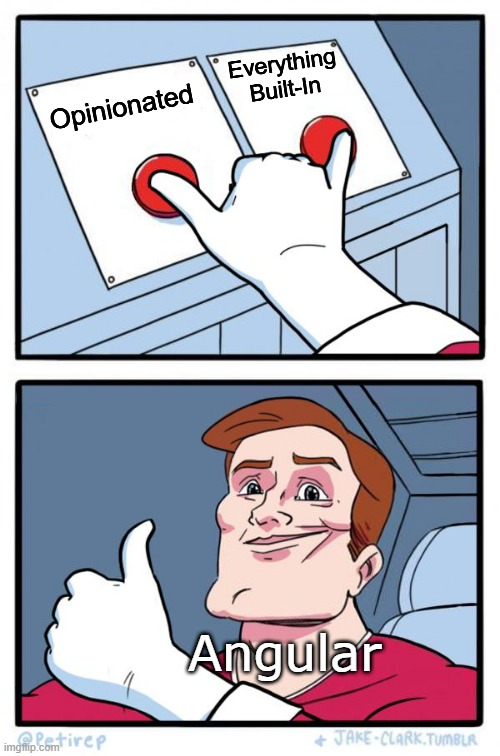

# You might not know about <Angular />!

- The reason why <Typescript/> popular
- The unspoken father of <Vue />
    - <strong class="text-red">Evan You</strong> was a former <Angular /> team member
    - <strong>Therefore, it's not a coincidence that Vue is heavily inspired by <Angular /></strong>
- The inspiration of <React /> and their fanboy
- <u>Faster</u> than both <React /> and <Vue />
    - In <u><small>very</small></u> specific conditions
- The motivation for ESBuild, Module Federation, Dependencies Injection, and many more...
- You (normally) have ONE way of doing things correctly

<v-click>

</v-click>

